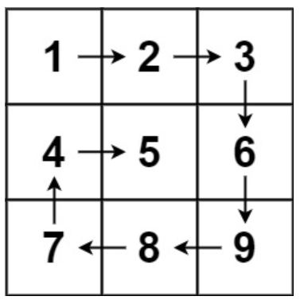
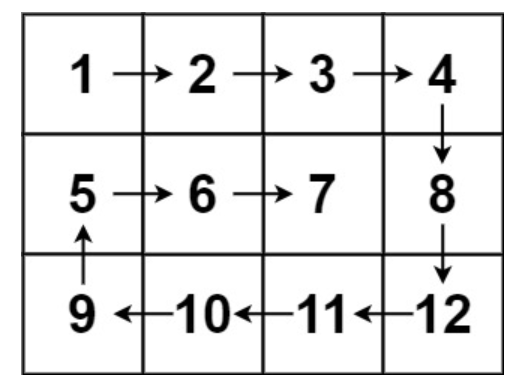
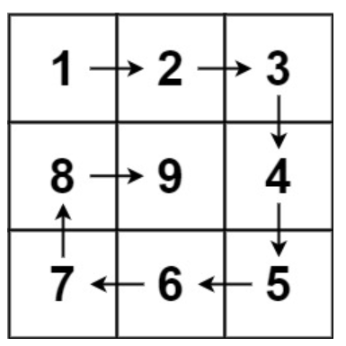

### Spiral Matrix
* Given an m x n matrix, return all elements of the matrix in spiral order.

Example 1:

Input: matrix = [[1,2,3],[4,5,6],[7,8,9]]
Output: [1,2,3,6,9,8,7,4,5]

Example 2:

Input: matrix = [[1,2,3,4],[5,6,7,8],[9,10,11,12]]
Output: [1,2,3,4,8,12,11,10,9,5,6,7]
 

Constraints:

m == matrix.length
n == matrix[i].length
1 <= m, n <= 10
-100 <= matrix[i][j] <= 10

### Solution 
* In this Solution need to think like we need to print boxes under boxes. And move from Top->Right->Bottem->Left.
    - In the Top line we move from min column to max column and min row will be fix.
    - In the Right line we move from min row to max row and max column will be fix.
    - In the Bottom line we move from max column to min column and max row will be fix.
    - In the Left line we move from max row to min row and min column will be fix.
    - And complete after every step fix edges will be increase or decrease.

### Spiral Matrix II
* Given a positive integer n, generate an n x n matrix filled with elements from 1 to n2 in spiral order.

Example 1:

Input: n = 3
Output: [[1,2,3],[8,9,4],[7,6,5]]
Example 2:

Input: n = 1
Output: [[1]]
 

Constraints:

1 <= n <= 20