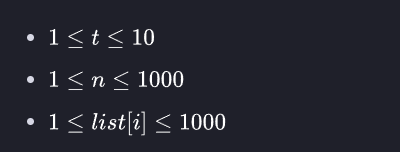

### Delete duplicate-value nodes from a sorted linked list
You are given the pointer to the head node of a sorted linked list, where the data in the nodes is in ascending order. Delete nodes and return a sorted list with each distinct value in the original list. The given head pointer may be null indicating that the list is empty.

Example

head refers to the first node in the list .

Remove 1 of the  data values and return  pointing to the revised list .

Function Description

Complete the removeDuplicates function in the editor below.

removeDuplicates has the following parameter:

SinglyLinkedListNode pointer head: a reference to the head of the list
Returns

SinglyLinkedListNode pointer: a reference to the head of the revised list
Input Format

The first line contains an integer , the number of test cases.

The format for each test case is as follows:

The first line contains an integer , the number of elements in the linked list.
Each of the next  lines contains an integer, the  value for each of the elements of the linked list.

Constraints

Sample Input

STDIN   Function
-----   --------
1       t = 1
5       n = 5
1       data values = 1, 2, 2, 3, 4
2
2
3
4
Sample Output

1 2 3 4 
Explanation

6
3
3
3
4
5
5