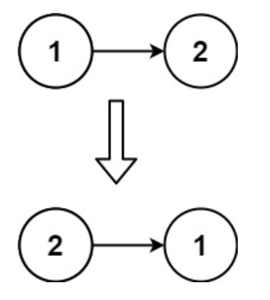

### Reverse Linked List
* Given the head of a singly linked list, reverse the list, and return the reversed list.

Example 1:

Input: head = [1,2,3,4,5]
Output: [5,4,3,2,1]
Example 2:

Input: head = [1,2]
Output: [2,1]
Example 3:

Input: head = []
Output: []
 

Constraints:

The number of nodes in the list is the range [0, 5000].
-5000 <= Node.val <= 5000

### Solution
1. Create two extra node curr and prev, assign curr as head and assign prev as null.
2. Check curr and use while loop for iterating.
3. Store curr next in tmp node.
4. Assign curr next as prev.
5. Assign curr as prev(reverse LL).
6. Assign curr stored tmp.
7. return prev(Reverse LL).